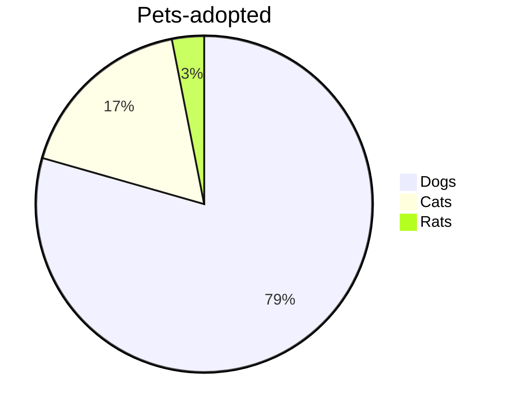
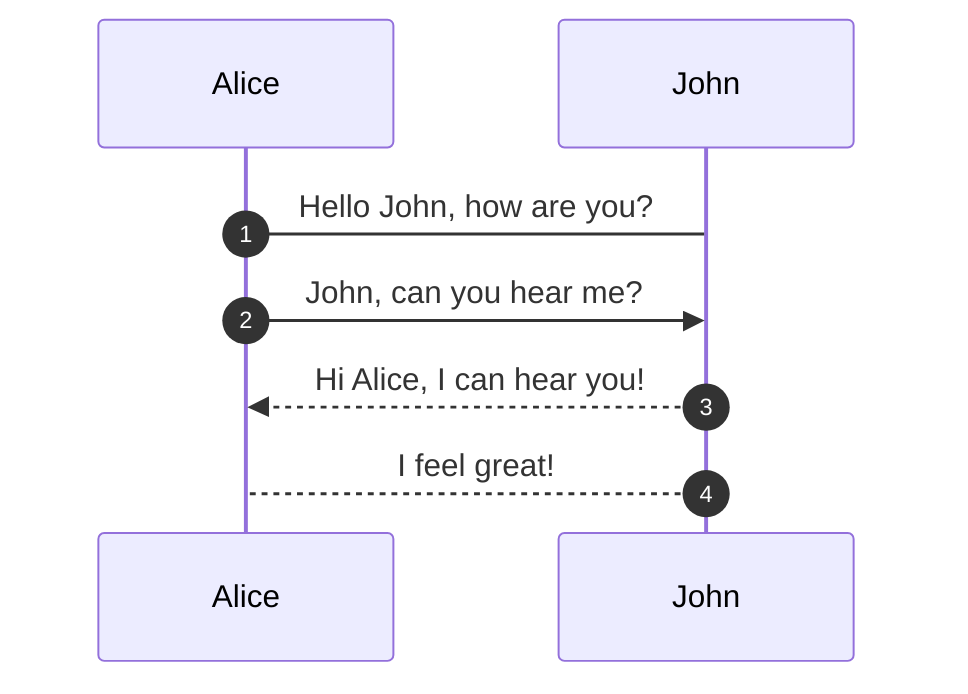
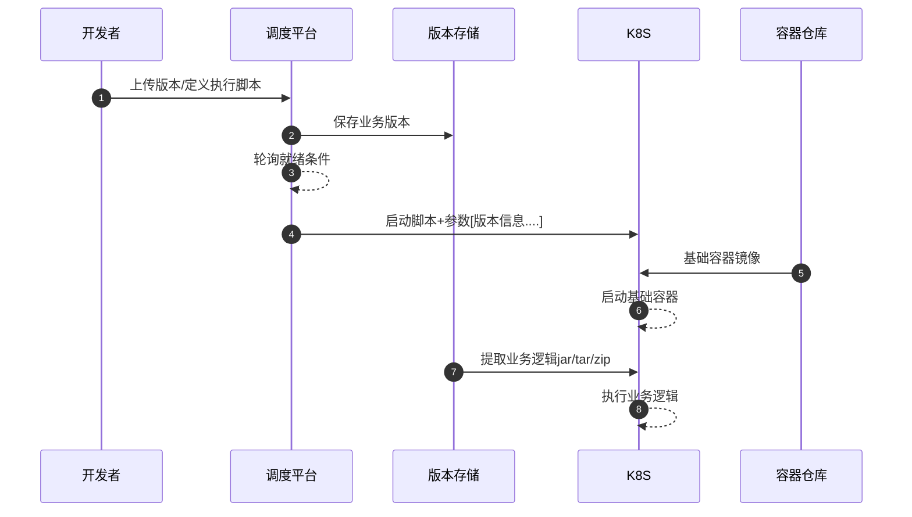
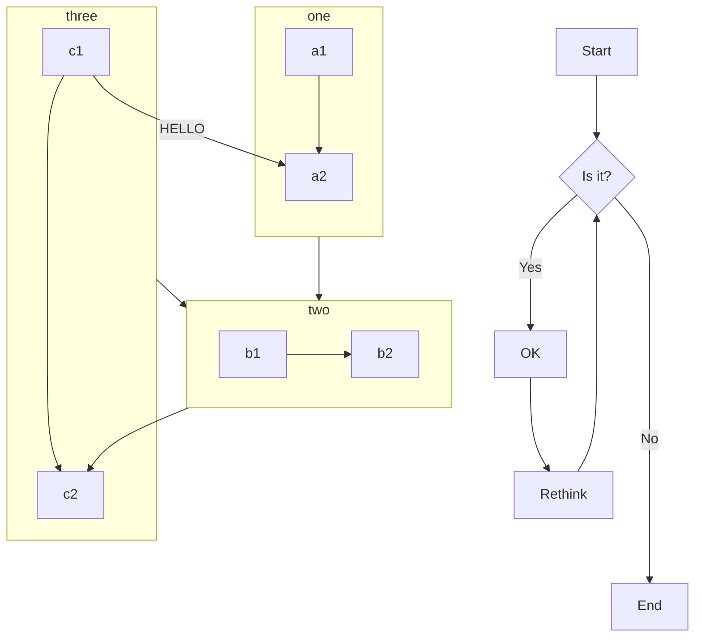
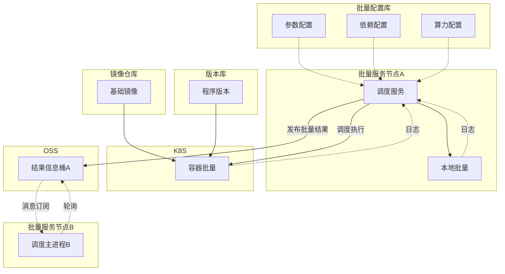
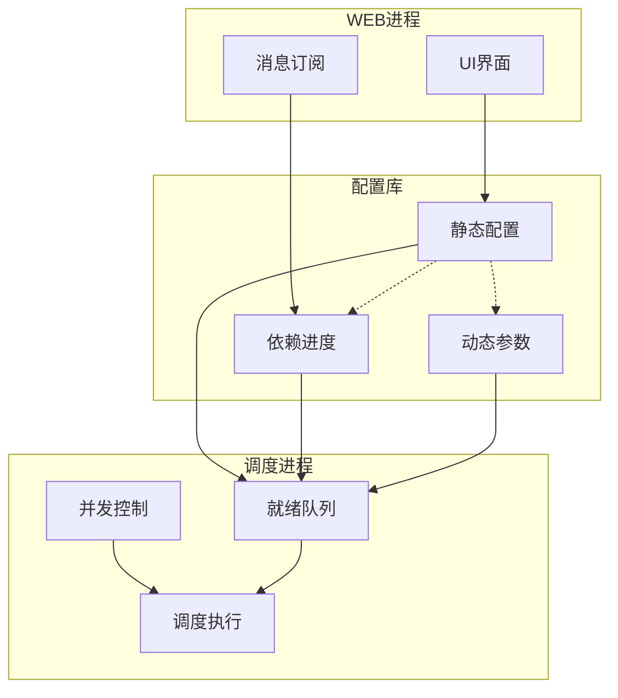

# Markdown(MD)文档编写补充说明

## 什么是Markdown

Markdown 是一种轻量级标记语言，它允许人们使用易读易写的纯文本格式编写文档。

Markdown 编写的文档后缀为 .md, .markdown。Markdown 能被使用来撰写电子书，如：Gitbook。

当前许多网站都广泛使用 Markdown 来撰写帮助文档或是用于论坛上发表消息。例如：GitHub、简书、reddit、Diaspora、Stack Exchange、OpenStreetMap 、SourceForge等。

如果经常浏览GitHub,每个仓库门口的readme就是一个markdown文件,只要访问仓库主页就能直接阅读.

现在一般API的接口说明文档也都是markdown.

## 为什么用Markdown

- markdown可以提供较好的阅读体验,虽然弱于word和html.
- markdown易于编写,甚至可以使用纯文本编辑器直接手工编写.
- markdown易于自动化处理,可以比较方便的使用程序自动读取和生成.
- markdown易于展示,可以很方便的在线上直接展示内容（有大量展示控件可以在web端渲染md）,也方便在线下本地阅读（也有很多好用的本地编辑器，比如Typora）.
- markdown是基于行规则的，意味着现代版本管理工具(比如git)能够自动分析合并，使大规模的团队协作成为可能。可以很多人同时编辑一个文件，提交合并成一个完整的文档。

通常撰写技术文档,使用markdown是一个不错的选择.

## 如何编辑Markdown

虽然纯手工编辑md文件是可能的,但通常还是推荐使用所见即所得的编辑器,笔者使用Typora.建议访问typora官网获取最新版本。

markdown的语法本文不再赘述,比如可以访问 https://www.runoob.com/markdown/md-tutorial.html 

下文对于编辑Markdown作一些简要补充.


### 插入图片

如果要插入图片,并且希望md在线上也能正常显示图片,在Typora中建议如下设置:

文件->偏好设置->图像，按照下图设置


然后操作 格式-〉图像->插入本地图片，Typora会将图片复制到当前文档位置。

之后通过git上传服务器的时候会一起上传，方便在服务端在线浏览。


### 段首缩进

通常md并不支持段首缩进，如果你想这样

&emsp;我要好看的段落缩进。

&emsp;&emsp;或者我要缩进更多一点。

可以这样编辑


### 代码框

MD格式提供了专门的代码框，可以根据你的代码样式提供不同的渲染，提升阅读体验。

比如java这样

```java
package sh.icbc.oss.client;
import static org.junit.Assert.*;
import java.util.regex.Matcher;
import java.util.regex.Pattern;
import org.junit.After;
import org.junit.AfterClass;
import org.junit.Before;
import org.junit.BeforeClass;
import org.junit.Test;

public class RegexPatterTest {
	@Test
	public void testRegEx() {
		try {
			String line1 = "201M_.obj";
			String PATTERN_TIME = "^[0-9]{4}\\-[0-9]{2}\\-[0-9]{2}\\s[0-9]{2}:[0-9]{2}:[0-9]{2},[0-9]{3}\\s";
			//String PATTERN_MID = "\\[WebContainer\\s:\\s[0-9]+\\]\\s[A-Z]{4,10}\\s+-\\s+[0-9]{20}#[a-zA-Z0-9_]{4,}@(置\\[|取\\[|置数据|取数据|<LOG4FLUME>)";
			String PATTERN_CONTENT = "\\[.{6,}\\]=\\[.{3,}\\]";
			String TEST_PATTERN_STR="^[0-9a-zA-Z_\\.]+$";
			
			
			Pattern PATTERN = Pattern.compile(TEST_PATTERN_STR);
			Matcher matcher = PATTERN.matcher(line1);
			boolean found = matcher.find();
			if (found) {
				System.out.println("SUCC");
			}else
			{
				System.out.println("FAIL");
			}
		} catch (Exception e) {
			e.printStackTrace();
			fail("Exception:" + e.getMessage());
		}
	}

}

```


比如SQL

```sql
select a.* from b where c=d group by e;
```

比如json这样

```json
{
 "channel" : {
   "chan_serialno" : "030202000000001431713864089",
   "chan_type" : 102.1,
   "oapp" : "F-APIP"
 },
  "commcitr" : {
    "accpin" : "",
    "amount" : "100",
    "cashexf" : "0",
    "crmdcardno" : "4270200059806910",
    "currtype" : "1",
    "drmdcardno" : "02000620010243533",
    "iftrxsernb" : "0004081",
    "ptrxsernb" : true,
    "req_date" : "20150911",
    "req_time" : "121212",
    "revtranf" : "0",
    "summary" : null,
    "termid" : 9,
    "trxcode" : "8103"
  }
}

```
## MD文档标题编号

在默认设置下，ＭＤ文档的各级标题不带顺序号，我们希望ＭＤ能够像ｗｏｒｄ那样呈现多极标题序号。

要实现这个功能，一般通过向typora添加额外的css配置实现。

```
typora->文件->偏好设置->外观->打开主题文件夹
```

然后编辑base.user.css，如果没有此文件则创建一个

将以下内容添加到base.user.css中

```css
/** initialize css counter */
#write {
    counter-reset: h1
}

h1 {
    counter-reset: h2
}

h2 {
    counter-reset: h3
}

h3 {
    counter-reset: h4
}

h4 {
    counter-reset: h5
}

h5 {
    counter-reset: h6
}

/** put counter result into headings */

#write h2:before {
    counter-increment: h2;
    content: counter(h2) ". "
}

#write h3:before,
h3.md-focus.md-heading:before /** override the default style for focused headings */ {
    counter-increment: h3;
    content: counter(h2) "." counter(h3) ". "
}

#write h4:before,
h4.md-focus.md-heading:before {
    counter-increment: h4;
    content: counter(h2) "." counter(h3) "." counter(h4) ". "
}

#write h5:before,
h5.md-focus.md-heading:before {
    counter-increment: h5;
    content: counter(h2) "." counter(h3) "." counter(h4) "." counter(h5) ". "
}

#write h6:before,
h6.md-focus.md-heading:before {
    counter-increment: h6;
    content: counter(h2) "." counter(h3) "." counter(h4) "." counter(h5) "." counter(h6) ". "
}

/** override the default style for focused headings */
#write>h3.md-focus:before,
#write>h4.md-focus:before,
#write>h5.md-focus:before,
#write>h6.md-focus:before,
h3.md-focus:before,
h4.md-focus:before,
h5.md-focus:before,
h6.md-focus:before {
    color: inherit;
    border: inherit;
    border-radius: inherit;
    position: inherit;
    left:initial;
    float: none;
    top:initial;
    font-size: inherit;
    padding-left: inherit;
    padding-right: inherit;
    vertical-align: inherit;
    font-weight: inherit;
    line-height: inherit;
} 

```

从二级标题开始，会自动添加序号。


## MD文档转WORD——Pandoc

typora可以直接处理PDF或者html等开源格式，但是如果需要将MD文档转换为WORD格式，则需要安装一个插件 pandoc。

可以直接访问pandoc的官网获取。

之后可以按照

```
文件->导出->Word 将文档转换为word格式
```

操作的时候建议将typora和pandoc都升级到最新版本。


## ＭＤ文档绘图——Mermaid

过去在文档中如果需要绘图，往往需要使用外部的软件，比如Viso，进行绘图，再通过贴图等方式倒入word文档。

但是Typora中就内建了绘图机制，这就是绘图的mermaid插件。

使用mermaid可以提供如下特性:

- 提供常用的技术图形解决方案，包括流程图，顺序图，ER图，甘特图等。


- 图片代码化矢量化，以和编写代码相似的方式画图。这样对git等版本管理软件非常友好，能够准确记录每次文档的修改。修改又十分方便。相对传统JPG可以大幅度节省IO消耗。


- 多端显示，特别是在WEB界面上可以直接绘图。


详细文档可以查看 https://merfaid-js.github.io。

例如

### 饼图


### 顺序图


另外一个例子




### 流程图



另外一个例子






### ER图

```mermaid
erDiagram
    CAR ||--o{ NAMED-DRIVER : allows
   	PERSON ||--o{ NAMED-DRIVER : is
   	A|o--||B :hello
   	B}o--|{C : byebye
    CAR {
        string allowedDriver FK 'The license of the allowed driver'
        string registrationNumber
        string make
        string model
    }
     
    PERSON {
        string driversLicense PK 'The license #'
        string firstName
        string lastName
        int age
    }

```


## 作业

各位学员编辑一个自我介绍的MD文件

1. 需要包括自己的图片和文字介绍。
2. 自己的学习经历，表格呈现。
3. 爱好和特长等等，表格呈现。
4. 各个内容要有大标题，有标题序号。
5. 提交到git上，能够直接在线浏览。
6. 画一个去饭店点餐吃饭的顺序图，参与方包括顾客，招待，厨师，收银。
7. 画一个规划旅游的流程图。体现包括选择目的地，出行方式等等决策过程。
8. 根据提供的csv数据，画ER图。

