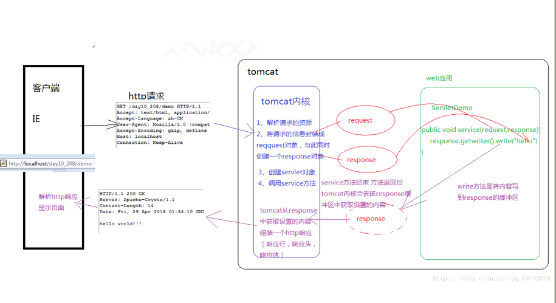
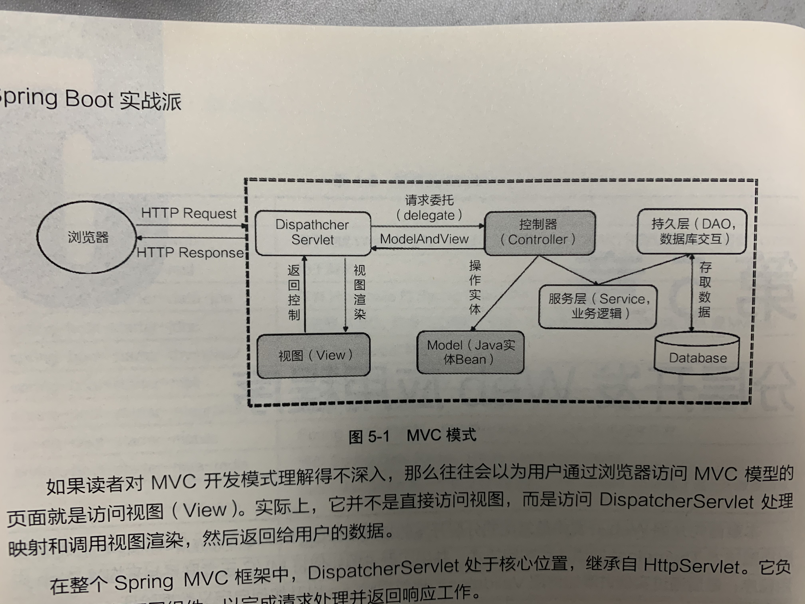
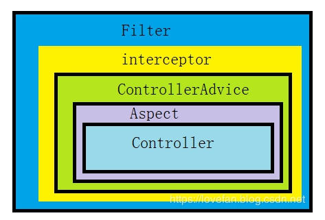

## 1.为什么用springboot?我们是在什么场景下用它?

一个成熟的java企业级框架

## 2.以前业界是怎么样的架构？

这一点上我们就需要知道servlets是什么？






大家可以去看一下这段代码 看看能否看的懂。

是否能看懂取决于你这部分的知识 ---http请求是什么？postman测试工具只是post了一段json报文吗？

```java
public class HttpServ extends HttpServlet {

    public void doGet(HttpServletRequest req, HttpServletResponse resp) throws ServletException, IOException {
        req.getRequestURI();
        req.getServerName();
        System.out.println("接收到get请求");
    }

    public void doPost(HttpServletRequest req, HttpServletResponse resp) throws ServletException, IOException {
        System.out.println("接收到POST请求");
        resp.setContentType("text/html;charset=utf-8");
        resp.getWriter().println("前台显示hello");
    }
}

```


## 3.springboot是为了解决什么问题诞生的？为什么他这么火？

Spring Boot最重要的是以下四个核心。
 自动配置：针对很多Spring应用程序常见的应用功能，Spring Boot能自动提供相关配置。
 起步依赖：告诉Spring Boot需要什么功能，它就能引入需要的库。
 命令行界面：这是Spring Boot的可选特性，借此你只需写代码就能完成完整的应用程序，
无需传统项目构建。
 Actuator：让你能够深入运行中的Spring Boot应用程序，一探究竟。

约定大于配置？  使用springboot1项目理解何为约定大于配置

## 4.springboot初探，最简单的springboot代码是怎样的？

详见maven1项目代码

引申说明：get/post/put/delete/patch等


## 5.controller的处理原理，controller处理了什么，区分开servlet和spring的规范分别是哪些。



## 6.简单讲述一下aspect,controllerAdvice,interceptor,filter的使用实例。

详见springboot2-3项目


## 7.回归spring本身，简单讲述一下IoC和DI帮助我们干了些什么？

```
* 1.介绍一般性j2se的对象创建方法
* 2.回顾数据结构中的几个名词:单例，工厂类，原型
* 3.简单讲述一下spring创建对象的方式方法
* 4.spring是一个支持并发的框架，其默认的对象创建设计模式是什么？修改其默认模式的方法

@Component @Service @Controller
@Data
@Autowired @Resource
```


```java
public class test{
    public static void main(String[] args) throws IOException {
        File f = new File("d:"+File.separator+"data.txt");
        
        //对象需要自己new 
        FileOutputStream fop = new FileOutputStream(f);
        OutputStreamWriter writer = new OutputStreamWriter(fop, "gbk");
        
        StringBuffer sb=new StringBuffer();
        for (int i=0;i<10;i++)
        {
        	int a = (int) (50 + Math.random() * (1000 - 1 + 1));
        	sb.append(a).append("|");
        }
        String output=new String (sb);
        output= output.substring(0,output.length()-1);
    	System.out.println(output);
        
        //销毁需要自己调用
    	writer.write(output);
        writer.flush();
        writer.close();
        fop.close();
    }
}
```

详见springboot4 循环依赖代码(spring提前帮忙申明并初始化了变量)


## 8.JDBC连接，基本的数据库操作

mybatis/jpa等数据库中间件

详见springboot5-jdbc相关

1.基本的增删改查

```
* 1.maven引用加入jdbc相关jar包
* 2.application.yml 的相关数据库配置
* 3.建立数据库相关表
* 4.根据表生成entity、mapper、service
* 5.在本类上加入mapper扫描注解
* 6.如何显示sql语句
* 7.如何定义自定义sql语句
* 8.记得添加切面和异常处理
```

2.事务类操作

```
* 1.使用注解@Transactional
```

## 9.单元测试

详见springboot5-jdbc相关

1.指定项目架构test域

2.创建基础springboot-test类：maven引用

3.自动化创建service的单元测试

